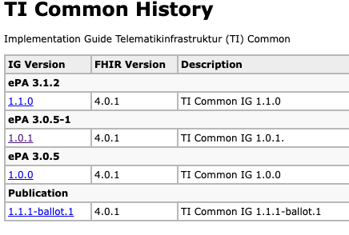
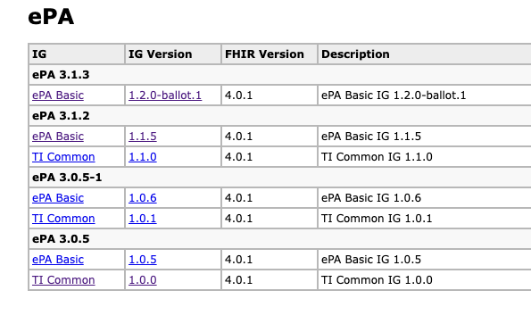

 <br/>

# FHIR Publish Tools

<details>
  <summary>Table of Contents</summary>
  <ol>
    <li>
      <a href="#about-the-project">About The Project</a>
      <ul>
        <li><a href="#release-notes">Release Notes</a></li>
      </ul>
	</li>
    <li>
      <a href="#getting-started">Getting Started</a>
      <ul>
        <li><a href="#publish-project">Publish Command</a></li>
        <li><a href="#render-ig-list">Render IG List Command</a></li>
      </ul>
      <a href="#installation">Installation</a>
      <ul>
        <li><a href="#native">Native</a></li>
        <li><a href="#docker">Docker Image</a></li>
      </ul>
    </li>
    <li><a href="#security-policy">Security Policy</a></li>
    <li><a href="#contributing">Contributing</a></li>
    <li><a href="#license">License</a></li>
    <li><a href="#contact">Contact</a></li>
  </ol>
</details>

## About The Project

Tooling to support the publication process. The functionality is inspired by the *go-publish* workflow of *IG Publisher*.

It produces the following structure in the `publish/` directory:

```text
<project name>/
    <version>/
        IG
    ig_history.json
    index.html
ig-build-zips/
    ZIP Archives 
```

A project directory is created containing a directory with the current version `<version>` that contains the published IG and a `ig_history.json` file containing all published versions of the IG and `index.html` presenting the history inspired by the history generated by *go-publish*.



and can also render this into a HTML file `index.html`



### Release Notes
See [ReleaseNotes](ReleaseNotes.md) for all information regarding the (newest) releases.

## Getting Started

The following comands are supported:

| Command       | Description             |
| ------------- | ----------------------- |
| `publish`     | Publish a project       |
| `render-list` | Render a `ig_list.json` |

### Publish Project

Does the following:

* Migrates older structure with `ig_history.json` to `package-list.json` and moves files from `publish/<project>/` to `publish/`
* Creates or updates `package-list.json` and `index.html` in `publish/`
* Creates or updates `package-feed.xml` and `index.html` in the IG Registry

#### Migration Information

To allow additional history information to be used for generating the history HTML file, include a `package-list*.json` file next to `package-list.json`. This can be useful to include an IG that may not be processable for IG comparison but should be included int the history page.

### Render IG List

Renders the contents of `ig_list.json` into an HTML file. The IGs are grouped by the sequence name and a group derived by the common part of the sequences, e.g. the sequences `My IG 1.0.0`, `My IG 1.0.1` and `Your IG 1.0.0` will be grouped by `My IG` and `Your IG` respectively.

## Installation

### Native

The tooling can either be installed as a standalone function using *pipx* or as a Python module.

#### pipx (preferred)

Install using pipx

```bash
pipx install --global git+https://github.com/gematik/publish-tools.git
```

Run from the command line

```bash
publishtools ...
```

#### Python Module

Check out this repository

```bash
git clone https://github.com/gematik/publish-tools.git
```

Install module

```bash
cd publish-tools
pip install .
```

Run from the command line

```bash
python -m publish_tools ...
```

<<<<<<< HEAD
## License

=======
### Docker

The Tool can be executed as a Docker Image.

Check out this repository

```bash
git clone https://github.com/gematik/publish-tools.git
```

Build the Image and execute it:

```bash
docker build -t gematik1/publisher .
docker run --rm -it gematik1/publisher:latest <command>
```

## Security Policy
If you want to see the security policy, please check our [SECURITY.md](.github/SECURITY.md).

## Contributing
If you want to contribute, please check our [CONTRIBUTING.md](.github/CONTRIBUTING.md).

## License
>>>>>>> 428a1ae (Added OSPO conventions, Dockerfile for building the tool)
Copyright 2025 gematik GmbH

Apache License, Version 2.0

<<<<<<< HEAD
See the [LICENSE](./LICENSE) for the specific language governing permissions and limitations under the License.
=======
See the [LICENSE](./LICENSE.md) for the specific language governing permissions and limitations under the License
>>>>>>> 428a1ae (Added OSPO conventions, Dockerfile for building the tool)

## Additional Notes and Disclaimer from gematik GmbH

1. Copyright notice: Each published work result is accompanied by an explicit statement of the license conditions for use. These are regularly typical conditions in connection with open source or free software. Programs described/provided/linked here are free software, unless otherwise stated.
2. Permission notice: Permission is hereby granted, free of charge, to any person obtaining a copy of this software and associated documentation files (the "Software"), to deal in the Software without restriction, including without limitation the rights to use, copy, modify, merge, publish, distribute, sublicense, and/or sell copies of the Software, and to permit persons to whom the Software is furnished to do so, subject to the following conditions:
<<<<<<< HEAD
    1. The copyright notice (Item 1) and the permission notice (Item 2) shall be included in all copies or substantial portions of the Software.
    2. The software is provided "as is" without warranty of any kind, either express or implied, including, but not limited to, the warranties of fitness for a particular purpose, merchantability, and/or non-infringement. The authors or copyright holders shall not be liable in any manner whatsoever for any damages or other claims arising from, out of or in connection with the software or the use or other dealings with the software, whether in an action of contract, tort, or otherwise.
    3. The software is the result of research and development activities, therefore not necessarily quality assured and without the character of a liable product. For this reason, gematik does not provide any support or other user assistance (unless otherwise stated in individual cases and without justification of a legal obligation). Furthermore, there is no claim to further development and adaptation of the results to a more current state of the art.
3. Gematik may remove published results temporarily or permanently from the place of publication at any time without prior notice or justification.
4. Please note: Parts of this code may have been generated using AI-supported technology. Please take this into account, especially when troubleshooting, for security analyses and possible adjustments.
=======
   1. The copyright notice (Item 1) and the permission notice (Item 2) shall be included in all copies or substantial portions of the Software.
   2. The software is provided "as is" without warranty of any kind, either express or implied, including, but not limited to, the warranties of fitness for a particular purpose, merchantability, and/or non-infringement. The authors or copyright holders shall not be liable in any manner whatsoever for any damages or other claims arising from, out of or in connection with the software or the use or other dealings with the software, whether in an action of contract, tort, or otherwise.
   3. We take open source license compliance very seriously. We are always striving to achieve compliance at all times and to improve our processes. If you find any issues or have any suggestions or comments, or if you see any other ways in which we can improve, please reach out to: ospo@gematik.de
3. Please note: Parts of this code may have been generated using AI-supported technology. Please take this into account, especially when troubleshooting, for security analyses and possible adjustments.

## Contact
E-Mail to [Alexander Essenwanger](mailto:alexander.essenwanger@gematik.de@gematik.de?subject=[GitHub]%20publish-tools)
>>>>>>> 428a1ae (Added OSPO conventions, Dockerfile for building the tool)
