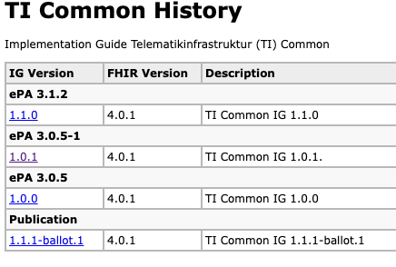

# FHIR Publish Tools

Tooling to support the publication process. The functionality is inspired by the *go-publish* workflow of *IG Publisher*.

It produces the following structure in the `publish/` directory:

```text
<project name>/
    <version>/
        IG
    ig_history.json
    index.html
ig-build-zips/
    ZIP Archives 
```

A project directory is created containing a directory with the current version `<version>` that contains the published IG and a `ig_history.json` file containing all published versions of the IG and `index.html` presenting the history inspired by the history generated by *go-publish*.



An archive of the current version is also created in `ig-build-zips/`.

It can also update a list different IG in `ig_list.json` that has the format:

```json
{
    "guides": [
        {
            "name": "<name>",
            "category": "<category>",
            "npm-name": "<package>",
            "description": "<description>",
            "canonical": "<canonical>",
            "ci-build": "<ci-build>",
            "editions": [
                {
                    "name": "<sequence-name>",
                    "ig-version": "<version>",
                    "package": "<package>#<version>",
                    "fhir-version": [
                        "<fhir-version>",
                        // ...
                    ],
                    "url": "<url>",
                    "description": "<edition description>"
                },
                // ...
            ]
        },
        // ...
    ]
}
```

and can also render this into a HTML file `index.html`


## Comands

The following comands are supported:

| Command       | Description             |
| ------------- | ----------------------- |
| `publish`     | Publish a project       |
| `render-list` | Render a `ig_list.json` |

### Publish Project

Does the following:

* Produces the IG in `<project name>/<version>/`
* Creates or updates `ig_history.json` and `index.html` in `<project name>/`
* Builds an archive of the current version in `ig-build-zips/`
* Creates or updates `ig_list.json` at the provided location

### Render IG List

Renders the contents of `ig_list.json` into an HTML file. The IGs are grouped by the sequence name and a group derived by the common part of the sequences, e.g. the sequences `My IG 1.0.0`, `My IG 1.0.1` and `Your IG 1.0.0` will be grouped by `My IG` and `Your IG` respectively.

## Installation

The tooling can either be installed as a standalone function using *pipx* or as a Python module.

### pipx (preferred)

Install using pipx

```bash
pipx install --global git+https://github.com/gematik/publish-tools.git
```

Run from the command line

```bash
publishtools ...
```

### Python Module

Check out this repository

```bash
git clone https://github.com/gematik/publish-tools.git
```

Install module

```bash
cd publish-tools
pip install .
```

Run from the command line

```bash
python -m publish_tools ...
```
